# FreeRTOS 骑行码表旗舰版（4G）详细实现分析

> 说明：本文结合当前项目源码与 `项目分析.md` 进行整理，重点展开各模块实现细节、模块间数据通信流程，以及关键函数调用关系。

---

## 1. 项目整体定位与运行主线

该项目运行在 **STM32F103C8 + FreeRTOS** 上，核心目标是完成以下闭环：

1. 通过 **GPS** 获取时间、速度、经纬度。
2. 通过 **AHT10** 获取温湿度。
3. 在 **bike 核心模块** 中按秒计算骑行数据。
4. 通过 **OLED** 实时显示骑行状态。
5. 按固定周期把骑行轨迹与统计摘要写入 **W25Qxx SPI Flash**。
6. 通过 **AIR780E 4G 模块** 把实时数据上传到云端，并从云端获取时间同步。
7. 通过 **USART1 调试口** 导出历史骑行记录。

从执行模型看，系统不是靠大量任务并发推进，而是采用：

- `bike_task` 作为**事件处理中心**。
- `air780e_at_task` 作为**4G 通信执行中心**。
- `timer_handle_bike_cb()` 作为**每秒心跳**。
- 多个硬件中断通过 **FreeRTOS Task Notification** 把事件送到任务侧。

---

## 2. 分层架构与职责边界

```text
[User Layer]
  main.c / bike.c / screen.c / flash_data.c / flash_index.c
        ↓
[System Layer]
  system.c / log.c
        ↓
[Driver Layer]
  GPS.c / AHT10.c / OLED.c / at_air780e.c / at_interface.c
  ringbuffer.c / linked_queue.c / usart.c / i2c_hard.c / spi_hard.c / W25Qxx.c / key.c
        ↓
[RTOS Layer]
  FreeRTOS task / timer / semaphore / task notification
        ↓
[HAL Layer]
  STM32 标准外设库
```

### 2.1 User 层

负责业务逻辑与设备功能编排：

- `User/main.c:37`：系统启动入口。
- `User/bike.c:642`：骑行主任务、状态机、数据计算、云端交互。
- `User/screen.c:12`：OLED 三种页面的展示封装。
- `User/flash_data.c:100`：轨迹记录缓存、打包、写入 Flash。
- `User/flash_index.c:153`：骑行记录索引管理与掉电恢复。

### 2.2 System 层

提供对 FreeRTOS 和日志的统一封装：

- `System/system.c:6`：时间、延时、堆分配、yield。
- `System/log.c:33`：带互斥保护的串口日志输出。

### 2.3 Driver 层

负责具体外设协议与收发：

- GPS：`Drivers/GPS.c:83`
- 4G 模块：`Drivers/at_air780e.c:408`
- AT 通道：`Drivers/at_interface.c:122`
- 环形缓冲：`Drivers/ringbuffer.c:26`
- OLED：`Drivers/OLED.c:255`
- AHT10：`Drivers/AHT10.c:27`
- I2C：`Drivers/i2c_hard.c:10`
- SPI / W25Qxx：`Drivers/spi_hard.c:10`、`Drivers/W25Qxx.c:124`
- 按键 / 串口：`Drivers/key.c:56`、`Drivers/usart.c:31`

---

## 3. 系统启动流程详解

### 3.1 启动入口

`main()` 位于 `User/main.c:37`，执行顺序非常清晰：

1. 配置 NVIC 分组。
2. 初始化 LED。
3. 初始化日志串口 USART1。
4. 执行 `bike_init()` 完成业务相关外设初始化。
5. 创建测试任务 `test`。
6. 执行 `bike_start()`，创建软件定时器和骑行主任务。
7. 初始化 `USART3`，启动 GPS 接收中断。
8. 调用 `vTaskStartScheduler()` 启动调度器。

### 3.2 启动调用图

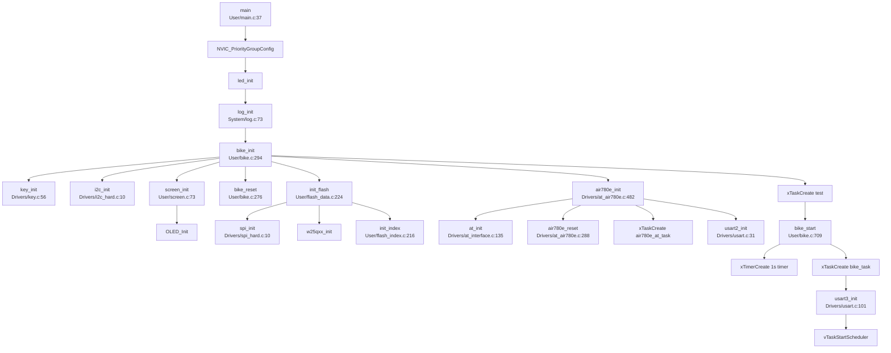

### 3.3 启动设计要点

- `usart3_init()` 放在 `bike_start()` 之后执行，原因是 GPS 中断到来后需要通知 `bike_task_handle`，因此必须先创建 `bike_task`，见 `User/main.c:50-52`。
- `air780e_init()` 在调度器启动前已完成任务创建与串口初始化，因此 4G 任务是系统启动时就常驻的。
- `bike_reset()` 启动时会调用 `set_first_write_flag()`，为新一轮骑行建立 Flash 写入起点，见 `User/bike.c:291`。

---

## 4. FreeRTOS 执行模型

该项目核心上只依赖两个业务任务和一个软件定时器：

### 4.1 bike_task

位置：`User/bike.c:642`

作用：

- 接收按键事件。
- 接收 GPS 帧到达事件。
- 接收 4G 连接成功事件。
- 接收时间同步完成事件。
- 处理串口导出命令。

接收方式：

```c
xTaskNotifyWait(0, 0xFFFFFFFF, &notify_bits, portMAX_DELAY);
```

即：

- 进入等待时不清位。
- 唤醒后清空全部通知位。
- 永久阻塞，等待事件驱动。

### 4.2 air780e_at_task

位置：`Drivers/at_air780e.c:408`

作用：

- 执行 4G 建链。
- 执行透传发送。
- 在 IDLE 中断通知后消费服务器下发数据。
- 执行断链与 PDP 关闭。

### 4.3 软件定时器

位置：`User/bike.c:698`

由 `bike_start()` 创建：`User/bike.c:711`

功能：

- 每秒刷新屏幕。
- RUNNING 状态下每秒计算本地骑行数据。
- RUNNING 状态下驱动云端上传和时间请求。

### 4.4 FreeRTOS 关键配置

来自 `FreeRTOS/inc/FreeRTOSConfig.h`：

- `configTICK_RATE_HZ = 1000`：1ms Tick，见 `FreeRTOS/inc/FreeRTOSConfig.h:82`
- `configUSE_PREEMPTION = 1`：抢占式调度，见 `FreeRTOS/inc/FreeRTOSConfig.h:87`
- `configUSE_TIME_SLICING = 0`：同优先级任务不按 tick 自动轮转，见 `FreeRTOS/inc/FreeRTOSConfig.h:94`
- `configMAX_PRIORITIES = 5`：最大优先级 5，见 `FreeRTOS/inc/FreeRTOSConfig.h:113`

这意味着：

1. 中断可及时唤醒目标任务。
2. `bike_task` 和 `test` 虽同为优先级 3，但不会仅因 tick 到来被轮转。
3. `air780e_at_task` 优先级 4，高于 `bike_task`，连接服务器和收发 4G 数据时会优先执行。

---

## 5. bike 核心模块实现细节

`User/bike.c` 是整个系统的业务中枢。

### 5.1 核心状态结构

`struct bike` 位于 `User/bike.c:41`，关键字段：

- `total_distance_km`：累计距离。
- `total_time_sec`：累计骑行时长。
- `speed_kmh`：实时速度。
- `max_speed_kmh`：最大速度。
- `average_speed_kmh`：平均速度。
- `temp/humi`：实时温湿度。
- `average_temp/average_humi`：平均温湿度。
- `kcal`：卡路里。
- `bike_state`：IDEL / RUNNING / STOP。
- `running_state`：未连服务器 / 已连服务器 / 已同步时间。
- `current_screen`：当前显示页。

### 5.2 状态机实现

状态切换入口：`bike_running_state_change()`，位于 `User/bike.c:136`。

#### IDEL -> RUNNING

条件：`gps_enable()` 为真，见 `User/bike.c:140`

执行：

1. 清屏。
2. `bike_state = RUNNING`
3. `current_screen = SCREEN_1`
4. 记录本次骑行开始时间：`set_table_created_timestamp(...)`
5. 调用 `air780e_start()` 异步通知 4G 任务建链。

#### RUNNING -> STOP

执行：

1. `bike_state = STOP`
2. 调用 `air780e_stop()` 请求断开 4G。
3. 调用 `save_item(..., STOP)` 把最后未满 13 条的缓存强制刷入 Flash，见 `User/bike.c:149-155`

#### STOP -> IDEL

执行：

1. 清屏。
2. `bike_reset()` 清零统计值、恢复欢迎页状态，见 `User/bike.c:156-160`

### 5.3 每秒本地数据处理

入口：`bike_local_handle()`，位于 `User/bike.c:536`

执行逻辑：

1. `total_time_sec++`
2. 调用 `bike_calc_running_data()` 更新速度、距离、统计值
3. 每 10 秒调用一次 `save_item()` 保存轨迹点

### 5.4 数据计算链

入口：`bike_calc_running_data()`，位于 `User/bike.c:197`

内部逻辑：

1. 从 GPS 获取原始速度 `gps_get_speed_kt()`。
2. 通过 `calc_distance_m(speed_kt, 1)` 计算 1 秒内位移。
3. 转换为 km，累加到 `total_distance_km`。
4. 更新 `speed_kmh`、`max_speed_kmh`、`average_speed_kmh`。
5. 用累计距离调用 `calc_kcal()` 计算卡路里。
6. 读取 AHT10 温湿度，更新实时值与平均值。
7. 首次采样后清除 `reset_data` 标志。

### 5.5 云端逻辑

入口：`bike_online_handle()`，位于 `User/bike.c:550`

根据 `running_state` 分 3 种情况：

#### RUNNING_NOT_CONNECTED_SERVER

什么都不做，见 `User/bike.c:564`

#### RUNNING_CONNECTED_SERVER

说明 TCP 已连通但还未同步时间，此时每秒请求一次时间：

- `bike_cloud_time_request()`，见 `User/bike.c:561-563`

#### RUNNING_UPDATED_TIME

说明已经收到服务器时间：

- `timestamp_local++`
- 每 2 秒上传一次骑行数据
- 每 180 秒重新请求一次时间

见 `User/bike.c:554-560`

---

## 6. 屏幕显示模块实现细节

`User/screen.c` 只负责显示，不处理业务。

### 6.1 显示入口

- `screen_welcome_show()`：`User/screen.c:12`
- `screen_1_show()`：`User/screen.c:25`
- `screen_2_show()`：`User/screen.c:45`
- `screen_init()`：`User/screen.c:73`

### 6.2 页面切换逻辑

`bike_screen_change()` 位于 `User/bike.c:122`

行为：

- `SCREEN_1 -> SCREEN_2`
- `SCREEN_2 -> SCREEN_1`
- 切换时先 `screen_clear()` 清屏

### 6.3 显示内容来源

`bike_screen_show()` 位于 `User/bike.c:101`

数据来源如下：

- 欢迎页：GPS 时间、GPS 是否定位
- 第一屏：实时速度、累计距离、累计时长、骑行状态
- 第二屏：最大速度、平均速度、卡路里、温湿度、骑行状态

### 6.4 显示调用图

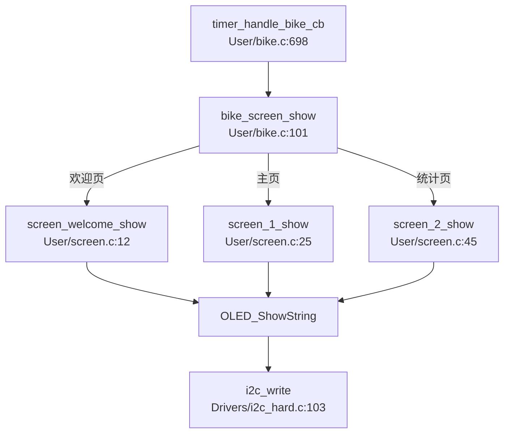

### 6.5 设计特点

- Screen 模块本身无状态，显示状态由 `my_bike.current_screen` 驱动。
- OLED 和 AHT10 共用 I2C，总线层通过 `i2c_mutex` 保证互斥，见 `Drivers/i2c_hard.c:7`、`Drivers/i2c_hard.c:34`。

---

## 7. GPS 模块实现细节

GPS 模块位于 `Drivers/GPS.c`。

### 7.1 内部状态

GPS 模块用一个静态结构保存当前解析结果，定义于 `Drivers/GPS.c:6`：

- `time_str`
- `speed_kt`
- `latitude`
- `longitude`
- `enable`

### 7.2 接收机制

硬件串口：USART3

中断入口：`User/stm32f10x_it.c:150`

调用链：

- `USART3_IRQHandler()`
- `gps_data_revevied()`，见 `Drivers/GPS.c:181`

接收逻辑：

1. 每收到 1 个字节放入 `rx_buffer`。
2. 遇到 `\n` 认为一帧 NMEA 句子结束。
3. 若句子以 `$GPRMC` 开头，则拷贝到 `gprmc_buffer`。
4. 设置 `gprmc_received = 1`。
5. 用 `xTaskNotifyFromISR()` 通知 `bike_task`：`NOTIFY_GPRMC_RECV`。

### 7.3 GPRMC 解析机制

解析函数：`parse_GPRMC()`，位于 `Drivers/GPS.c:83`

提取字段：

- UTC 时间
- 定位状态 A/V
- 纬度及方向
- 经度及方向
- 速度（节）
- 日期

随后调用 `UTC_to_BJT()`，把 UTC 转成北京时间，见 `Drivers/GPS.c:41`。

### 7.4 GPS 数据通信流程图

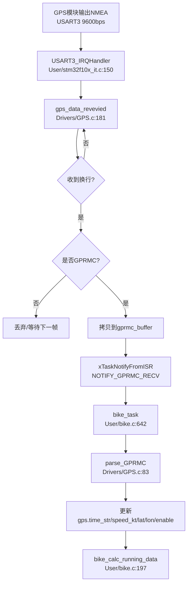

### 7.5 关键特征

- GPS 模块不直接操作业务结构 `my_bike`，而是只维护自己的静态 GPS 状态。
- `bike_task` 负责把“GPS 更新事件”接入业务流。
- 定时器每秒再从 GPS 模块读取数据进入计算链，因此 GPS 与业务计算是**事件触发 + 周期读取**组合。

---

## 8. AHT10 温湿度模块实现细节

模块位置：`Drivers/AHT10.c`

### 8.1 读取流程

入口：`aht10_read()`，位于 `Drivers/AHT10.c:27`

处理步骤：

1. 发送测量命令 `0xAC 0x33 0x00`
2. 延时 80ms 等待转换完成
3. 读取 6 字节原始数据
4. 检查校准位和忙位
5. 解析湿度 `SRH`
6. 解析温度 `ST`
7. 转换成浮点温湿度返回

### 8.2 调用位置

由 `bike_calc_running_data()` 每秒调用一次，见 `User/bike.c:209-212`

### 8.3 AHT10 通信调用图

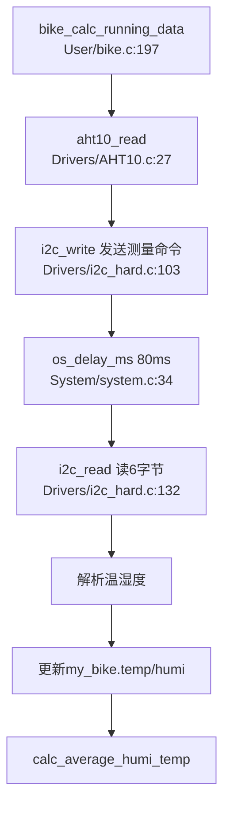

### 8.4 设计特点

- AHT10 是同步阻塞读取。
- 因为运行在定时器服务任务上下文中，所以这 80ms 会占用 timer task 执行时间，这是系统当前的一个实现特征。
- I2C 底层有互斥锁，避免与 OLED 同时抢总线。

---

## 9. Flash 数据存储模块实现细节

Flash 存储相关逻辑分成两层：

- `flash_data.c`：管理轨迹数据页。
- `flash_index.c`：管理“每次骑行”的索引元数据。

---

### 9.1 flash_data：记录打包与写页

关键函数：

- `save_item()`：`User/flash_data.c:100`
- `write_record_to_flash()`：`User/flash_data.c:57`
- `print_table_n()`：`User/flash_data.c:163`
- `init_flash()`：`User/flash_data.c:224`

#### 记录格式

每条 Flash 页固定 256 字节：

- 13 个 `riding_item`
- 2 字节保留
- 1 个 `riding_status`

其中：

- `riding_item` 18 字节：经度、纬度、速度
- `riding_status` 20 字节：结束时间、最大速度、平均速度、卡路里、均温湿度、总距离等

#### 写入机制

`save_item()` 每次被调用时：

1. 把当前经纬度字符串转成 `double`。
2. 把速度转成 `uint16_t`。
3. 放入静态数组 `items[]`。
4. 满 13 条，或者状态为 `STOP`，则组装一页并写入 Flash。

#### 首次写入逻辑

`write_record_to_flash()` 中使用静态 `write_first_item` 标志：

- 首条数据写入时调用 `get_next_table_addr()` 确定该次骑行存储分区起始地址，见 `User/flash_data.c:77-80`
- 首条数据写入后调用 `write_index()` 更新索引，见 `User/flash_data.c:94-97`

这说明：

- 轨迹正文和索引元数据是分两部分写入的。
- 索引只在该次骑行第一次真正落盘时更新，而不是在开始骑行时就写入。

---

### 9.2 flash_index：骑行索引与掉电恢复

关键函数：

- `read_index_from_flash()`：`User/flash_index.c:115`
- `write_index()`：`User/flash_index.c:153`
- `set_table_created_timestamp()`：`User/flash_index.c:169`
- `get_table_n_addr()`：`User/flash_index.c:193`
- `get_next_table_addr()`：`User/flash_index.c:206`

#### 索引结构的核心意义

索引保存：

- 已存骑行次数 `ntables`
- 下一次要写哪张表 `next_table_i`
- 每次骑行的开始时间戳 `table_ts[]`
- 当前版本号 `next_version`
- 索引写入扇区编号 `next_no`
- 写入标记 `write_flag`

#### 双区轮写设计

索引区有两个 4KB 扇区：

- `INDEX_SECTOR0_START = 0x0000`
- `INDEX_SECTOR1_START = 0x1000`

每次写索引：

1. 根据 `next_no` 选择目标扇区。
2. 擦除该扇区。
3. 写入当前 index 结构。
4. 调用 `set_next_index()` 递增版本号、切换下次索引扇区。

见 `User/flash_index.c:153-167`

#### 掉电恢复机制

启动时 `read_index_from_flash()` 同时读取两个索引扇区，见 `User/flash_index.c:122-123`，然后：

- 若两个都有效，则选择版本号更新的那个。
- 若只有一个有效，则使用那个。
- 若都无效，则初始化全新索引。

这就是典型的**双缓冲元数据恢复**策略。

---

### 9.3 Flash 数据通信流程图

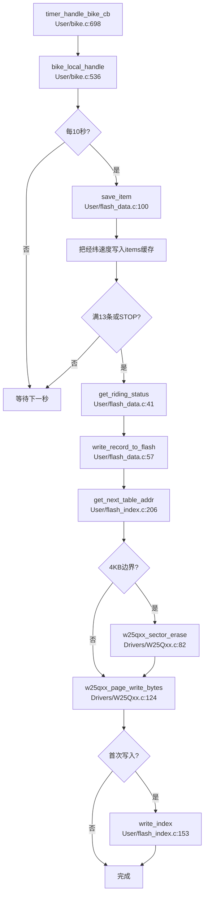

### 9.4 Flash 导出流程

调试串口收到命令后：

- `get data`：列出已有骑行记录。
- 输入数字：导出指定记录。

调用链：

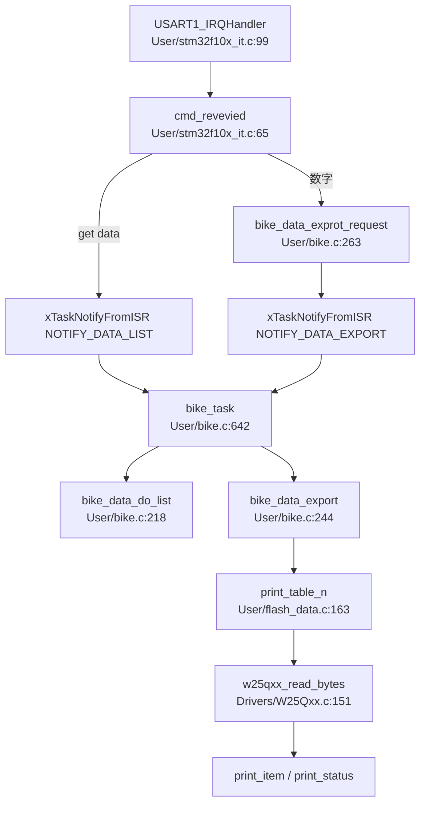

---

## 10. 4G 模块实现细节

4G 通信由 `Drivers/at_air780e.c`、`Drivers/at_interface.c`、`Drivers/ringbuffer.c`、`Drivers/linked_queue.c` 共同完成。

---

### 10.1 at_interface：AT 通道基础层

关键函数：

- `at_passthrough_send()`：`Drivers/at_interface.c:14`
- `at_passthrough_receive()`：`Drivers/at_interface.c:28`
- `at_send_cmd()`：`Drivers/at_interface.c:37`
- `at_receive_byte()`：`Drivers/at_interface.c:48`
- `at_wait_for_response()`：`Drivers/at_interface.c:66`
- `at_execute()`：`Drivers/at_interface.c:122`

#### 核心职责

1. 发送 AT 指令字符串。
2. 在接收中断里收集字节到 `at_ringbuf`。
3. 在任务中轮询 ringbuffer，等待成功/失败响应关键字。
4. 在透传模式下直接发送和接收原始数据。

#### 工作模式区分

- **AT 模式**：通过 `at_execute()` 发命令并等待字符串响应。
- **透传模式**：通过 `at_passthrough_send()` 直接发业务数据，通过 `at_passthrough_receive()` 收业务数据。

---

### 10.2 ringbuffer：USART2 接收缓存层

关键函数：

- `ringbuffer_write()`：`Drivers/ringbuffer.c:26`
- `ringbuffer_read()`：`Drivers/ringbuffer.c:39`

作用：

- RXNE 中断逐字节写入。
- 任务侧一次性读取尽可能多的数据。

特点：

- 无互斥锁。
- 当前使用场景是“ISR 单写 + 任务单读”，因此结构简单。

---

### 10.3 linked_queue：待发送队列

关键函数：

- `enqueue()`：`Drivers/linked_queue.c:31`
- `dequeue()`：`Drivers/linked_queue.c:54`

作用：

- `bike_task` 不直接操作 USART2 发数据。
- 而是把待发送 JSON 放入 `cmd_queue`。
- `air780e_at_task` 被通知后统一从队列取出并发送。

这样发送路径就从“业务逻辑”剥离到了“4G 通信任务”。

---

### 10.4 air780e_at_task：4G 任务执行层

关键任务函数：`Drivers/at_air780e.c:408`

#### 支持的通知位

- `NOTIFY_START_AIR780E`
- `NOTIFY_SEND_DATA`
- `NOTIFY_USART_RX`
- `NOTIFY_STOP_AIR780E`

#### 建链流程

由 `air780e_start()` 触发，见 `Drivers/at_air780e.c:470`

核心执行函数：`air780e_activate_connect_server()`，见 `Drivers/at_air780e.c:341`

顺序：

1. `AT` 检查模块就绪。
2. `ATE0` 关闭回显。
3. `AT+CPIN?` 检查 SIM 是否 READY。
4. `AT+CREG?` 检查网络注册。
5. `AT+CGATT?` 检查 GPRS 附着。
6. `AT+CIPMODE=1` 切透传模式。
7. `AT+CIPSTART` 建立 TCP。
8. 建链成功后开启 USART2 的 IDLE 中断。
9. 通知 `bike_task`：`NOTIFY_CONNECTED_SERVER`。

#### 断链流程

由 `air780e_stop()` 触发，见 `Drivers/at_air780e.c:465`

处理顺序：

1. 关闭 USART2 IDLE 中断。
2. 发送 `+++` 退出透传。
3. `AT+CIPCLOSE` 关闭 TCP。
4. `AT+CIPSHUT` 关闭 PDP。

见 `Drivers/at_air780e.c:309-333`

---

### 10.5 4G 上行数据：上传链路

上传业务函数：`bike_cloud_upload_data()`，位于 `User/bike.c:515`

其内部：

1. 调用 `encode_bike_upload()` 组装 JSON，见 `User/bike.c:465`
2. 把纬经度从度分格式转十进制度，再转 GCJ-02，见 `User/bike.c:426`
3. 调用 `air780e_send_data()` 入队，见 `Drivers/at_air780e.c:258`
4. 通知 `air780e_at_task` 发送

### 10.6 4G 下行数据：时间同步链路

服务器数据接收后：

1. USART2 RXNE 中断逐字节写入 ringbuffer。
2. IDLE 中断触发说明一帧接收结束。
3. 通知 `air780e_at_task` 消费 ringbuffer。
4. `recv_cb()` 回调到 `air780e_recv_data_cb()`，见 `User/bike.c:571`
5. `bike_handle_server_data()` 解析 JSON，见 `User/bike.c:388`
6. 若 `cmd == "time response"`，则解析 `time` 字段。
7. `timestamp_local = timestamp_cloud + 8 * 3600`
8. 通知 `bike_task`：`NOTIFY_TIME_UPDATE`
9. `bike_task` 把 `running_state` 切到 `RUNNING_UPDATED_TIME`

### 10.7 4G 数据通信流程图

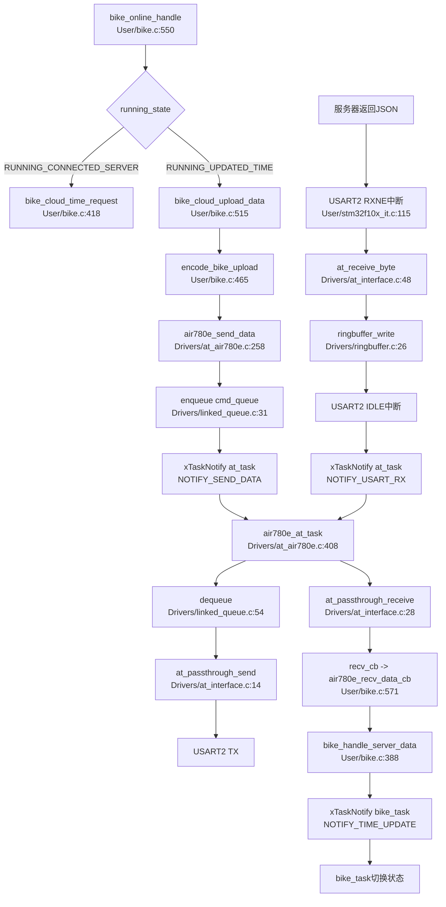

### 10.8 4G 建链调用图

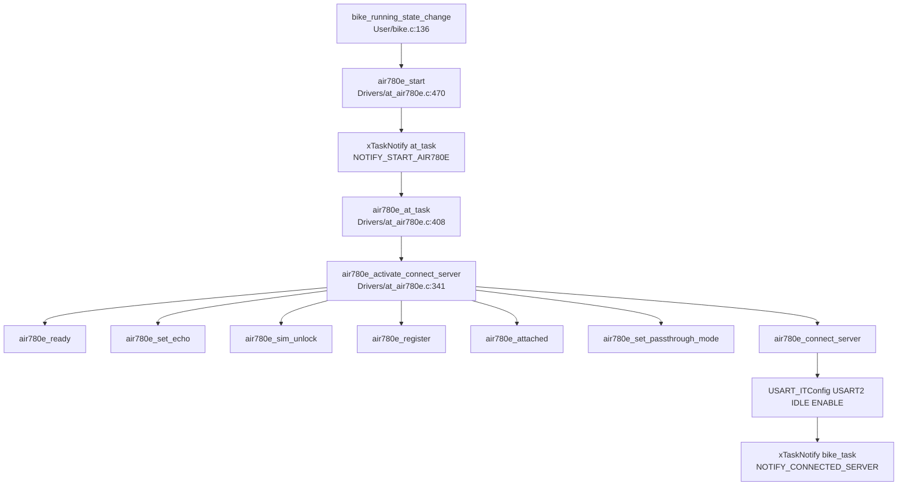

---

## 11. 按键与串口命令模块实现细节

### 11.1 按键模块

按键初始化：`Drivers/key.c:56`

配置：

- KEY1：PB0，EXTI0
- KEY2：PC14，EXTI15_10
- 触发方式：下降沿中断

中断处理：

- KEY1：`User/stm32f10x_it.c:19`
- KEY2：`User/stm32f10x_it.c:40`

按键中断并不直接变更状态，而是只做：

- 判断当前引脚是否低电平
- 通知 `bike_task`

真正的消抖与等待松手在任务内完成：

- `is_key1_press()`：`User/bike.c:608`
- `is_key2_press()`：`User/bike.c:625`

这意味着项目采用的是：

**中断只报事件，业务侧再做二次确认**。

### 11.2 USART1 调试命令

串口中断入口：`User/stm32f10x_it.c:99`

命令处理函数：`cmd_revevied()`，见 `User/stm32f10x_it.c:65`

支持：

- `get data`：列出历史骑行记录
- 数字 `1~16`：导出第 n 条记录

处理逻辑：

1. 中断中收字符到 `rx_buffer`
2. 收到换行后解析
3. 转换为通知给 `bike_task`
4. 由任务执行 Flash 访问和打印

---

## 12. System 模块实现细节

### 12.1 system.c

位置：`System/system.c`

作用：给应用层提供统一的 OS 抽象，避免直接大量散落调用 FreeRTOS API。

关键接口：

- `os_millis()`：`System/system.c:6`
- `os_millisFromISR()`：`System/system.c:14`
- `os_delay_ms()`：`System/system.c:34`
- `os_delay_s()`：`System/system.c:43`
- `os_task_yield()`：`System/system.c:53`
- `os_malloc()`：`System/system.c:67`
- `os_free()`：`System/system.c:74`

### 12.2 log.c

位置：`System/log.c`

关键点：

- `log_mutex` 保证多任务输出不串行错乱，见 `System/log.c:10`、`System/log.c:44`
- `os_log()` 带文件名和行号输出，见 `System/log.c:33`
- `os_printf()` 用于非带级别输出，见 `System/log.c:60`
- `fputc()` 被重定向到 USART1，见 `Drivers/usart.c:170`

### 12.3 System 调用关系图

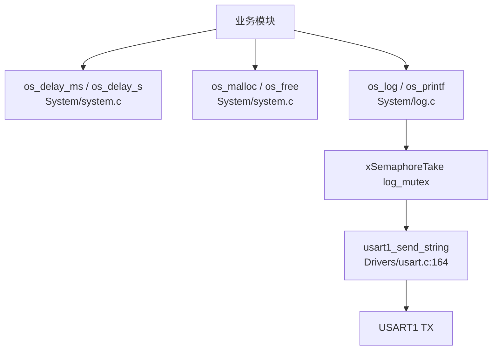

---

## 13. 模块总数据通信流程

下面给出整个项目的主数据流总图。

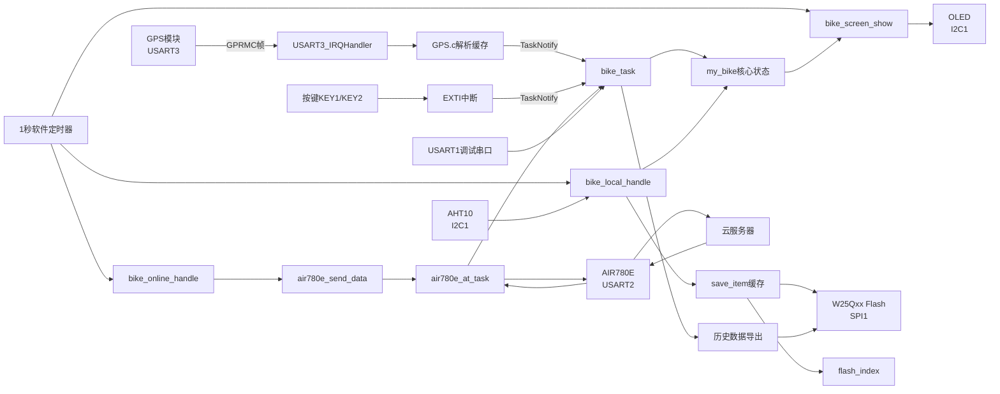

---

## 14. 各核心模块函数调用图

---

### 14.1 bike 核心调用图

```mermaid
flowchart TD
    A[bike_init\nUser/bike.c:294] --> A1[key_init]
    A --> A2[i2c_init]
    A --> A3[screen_init]
    A --> A4[bike_reset]
    A --> A5[init_flash]
    A --> A6[air780e_init]

    B[bike_start\nUser/bike.c:709] --> B1[xTimerCreate]
    B --> B2[xTaskCreate bike_task]

    C[bike_task\nUser/bike.c:642] --> C1[is_key1_press]
    C1 --> C2[bike_running_state_change]
    C --> C3[is_key2_press]
    C3 --> C4[bike_screen_change]
    C --> C5[parse_GPRMC]
    C --> C6[bike_data_do_list]
    C --> C7[bike_data_export]

    D[timer_handle_bike_cb\nUser/bike.c:698] --> D1[bike_screen_show]
    D --> D2[bike_local_handle]
    D --> D3[bike_online_handle]
    D2 --> D21[bike_calc_running_data]
    D2 --> D22[save_item]
    D3 --> D31[bike_cloud_upload_data]
    D3 --> D32[bike_cloud_time_request]
```

---

### 14.2 GPS 模块调用图

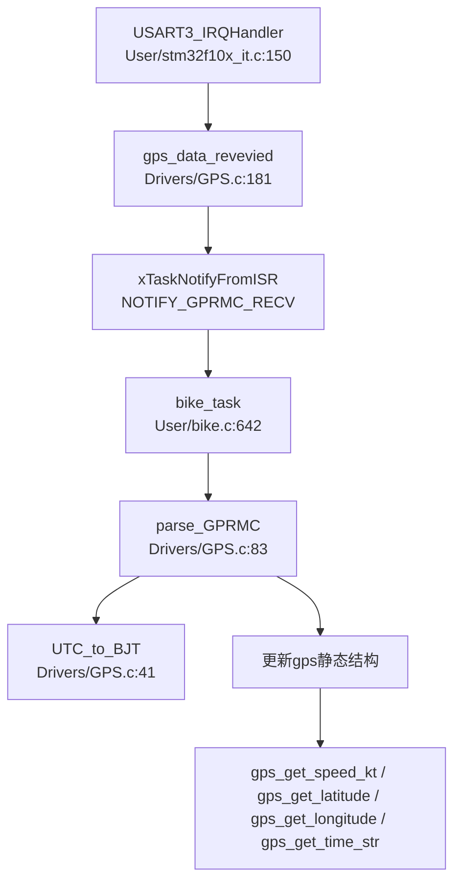

---

### 14.3 4G 模块调用图

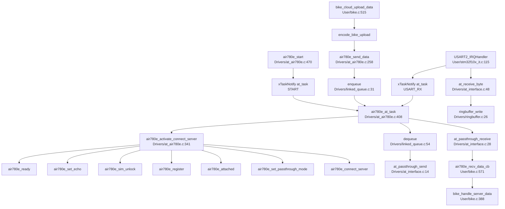

---

### 14.4 Flash 存储模块调用图

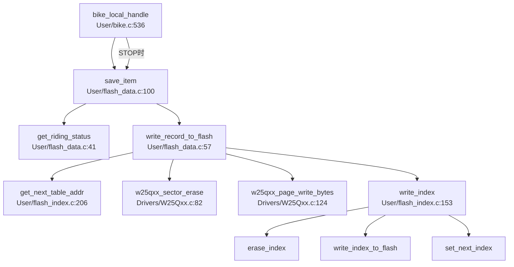

---

### 14.5 屏幕显示模块调用图

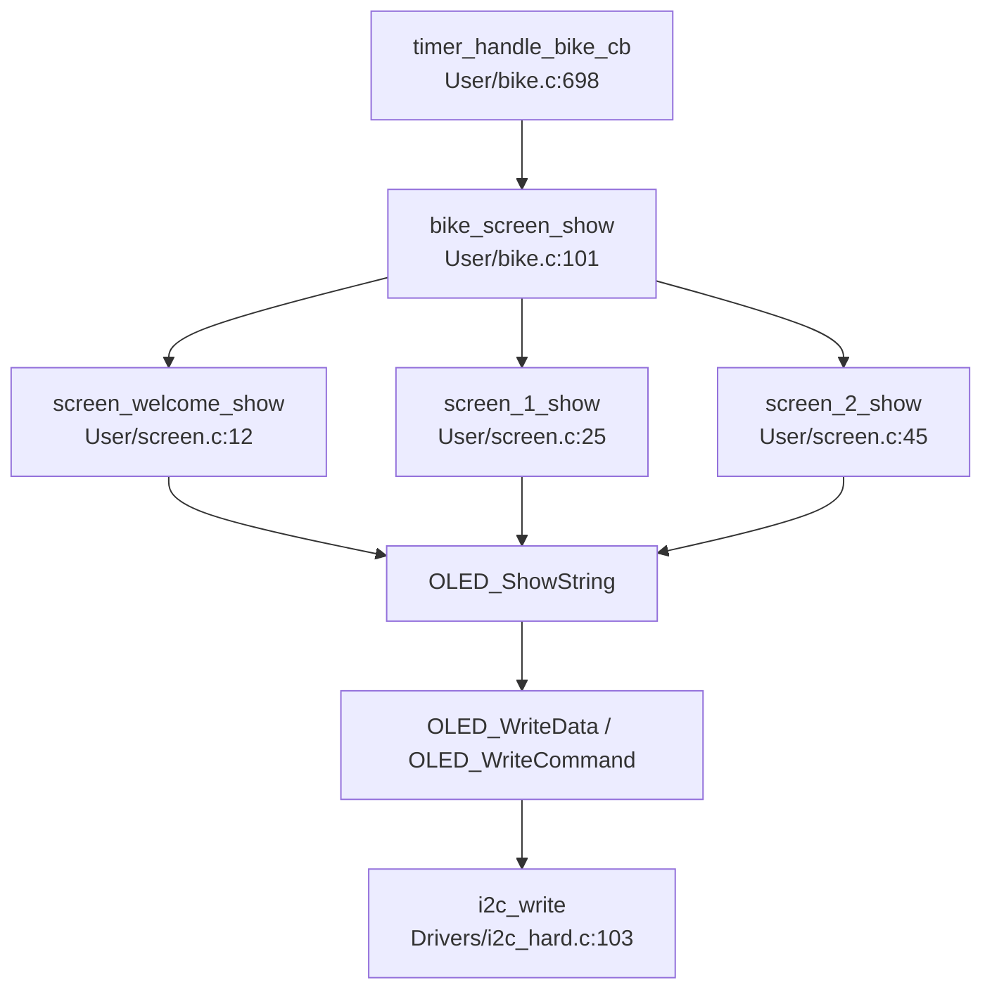

---

### 14.6 调试导出模块调用图

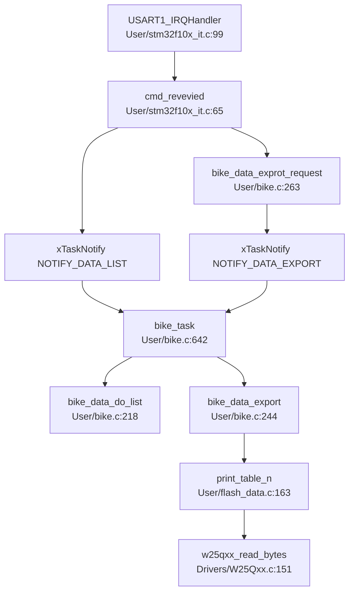

---

## 15. 中断、任务、定时器之间的事件关系

### 15.1 bike_task 使用的通知位

定义位置：`User/bike.h`

- `NOTIFY_KEY1_PRESS`
- `NOTIFY_KEY2_PRESS`
- `NOTIFY_GPRMC_RECV`
- `NOTIFY_CONNECTED_SERVER`
- `NOTIFY_TIME_UPDATE`
- `NOTIFY_DATA_LIST`
- `NOTIFY_DATA_EXPORT`

### 15.2 at_task 使用的通知位

定义位置：`Drivers/at_air780e.h`

- `NOTIFY_START_AIR780E`
- `NOTIFY_STOP_AIR780E`
- `NOTIFY_SEND_DATA`
- `NOTIFY_USART_RX`

### 15.3 事件总表

| 事件源 | 发送位置 | 目标任务 | 作用 |
|---|---|---|---|
| KEY1 中断 | `User/stm32f10x_it.c:26` | `bike_task` | 切换 IDEL/RUNNING/STOP |
| KEY2 中断 | `User/stm32f10x_it.c:49` | `bike_task` | 切屏 |
| GPS 收到 GPRMC | `Drivers/GPS.c:198` | `bike_task` | 解析 GPS 数据 |
| 4G 连上服务器 | `Drivers/at_air780e.c:426` | `bike_task` | 切到已连接状态 |
| 收到时间同步 | `User/bike.c:402` | `bike_task` | 切到已同步状态 |
| USART1 get data | `User/stm32f10x_it.c:83` | `bike_task` | 列表输出 |
| USART1 数字命令 | `User/stm32f10x_it.c:90` | `bike_task` | 导出骑行记录 |
| bike 请求建链 | `Drivers/at_air780e.c:477` | `air780e_at_task` | 执行建链 |
| bike 请求发数据 | `Drivers/at_air780e.c:271` | `air780e_at_task` | 透传发送 |
| USART2 IDLE | `User/stm32f10x_it.c:139` | `air780e_at_task` | 读取服务器下发数据 |
| bike 请求断链 | `Drivers/at_air780e.c:467` | `air780e_at_task` | 执行断链 |

---

## 16. 关键实现特征总结

### 16.1 业务核心是 `my_bike`

`my_bike` 是所有实时业务状态的单一汇总中心，位于 `User/bike.c:64`。

- GPS 提供位置、时间、速度。
- AHT10 提供温湿度。
- 本地计算更新总距离、均速、卡路里。
- Screen 从 `my_bike` 取数据展示。
- Flash 从 `my_bike` 取统计摘要写盘。
- 4G 上传从 `my_bike` 取实时数据打包上报。

### 16.2 中断只做轻处理

项目中断设计比较统一：

- 不在中断里做复杂业务。
- 中断只负责缓存字节、置位通知、触发调度。
- 真正耗时逻辑放到任务或定时器回调里处理。

### 16.3 数据链路分为三类

1. **中断驱动链路**：按键、GPS、USART2 IDLE。
2. **周期驱动链路**：1 秒定时器负责本地计算、显示、云端周期动作。
3. **存储驱动链路**：10 秒一采样、13 条一页、STOP 强制刷盘。

### 16.4 4G 模块采用“双缓冲式通信结构”

上行：

- JSON 入链式队列 `cmd_queue`
- `air780e_at_task` 统一发送

下行：

- RXNE 中断写 ringbuffer
- IDLE 中断通知任务批量处理

这使得 4G 收发与业务逻辑解耦较好。

### 16.5 Flash 索引支持掉电恢复

`flash_index.c` 通过双扇区轮写 + 版本号比较，保证索引元数据在异常断电后依然可恢复，这也是整个历史数据功能能长期稳定工作的关键。

---

## 17. 一句话总结系统主闭环

该项目的完整主闭环可以概括为：

**GPS/按键/串口中断产生活动事件 → bike_task 处理事件并维护业务状态 → 1 秒定时器驱动本地计算、界面刷新与云端交互 → 周期性写入 Flash 与上传服务器 → 服务器时间再回流到 bike 状态机中。**

---

## 18. 关键源码定位索引

| 模块 | 关键函数 | 位置 |
|---|---|---|
| 系统启动 | `main()` | `User/main.c:37` |
| 骑行初始化 | `bike_init()` | `User/bike.c:294` |
| 骑行主任务 | `bike_task()` | `User/bike.c:642` |
| 每秒回调 | `timer_handle_bike_cb()` | `User/bike.c:698` |
| 状态切换 | `bike_running_state_change()` | `User/bike.c:136` |
| 本地数据处理 | `bike_local_handle()` | `User/bike.c:536` |
| 云端处理 | `bike_online_handle()` | `User/bike.c:550` |
| 上传打包 | `encode_bike_upload()` | `User/bike.c:465` |
| 服务器数据解析 | `bike_handle_server_data()` | `User/bike.c:388` |
| GPS 接收 | `gps_data_revevied()` | `Drivers/GPS.c:181` |
| GPS 解析 | `parse_GPRMC()` | `Drivers/GPS.c:83` |
| 4G 主任务 | `air780e_at_task()` | `Drivers/at_air780e.c:408` |
| 4G 建链 | `air780e_activate_connect_server()` | `Drivers/at_air780e.c:341` |
| AT 执行 | `at_execute()` | `Drivers/at_interface.c:122` |
| Flash 写页 | `write_record_to_flash()` | `User/flash_data.c:57` |
| Flash 索引写入 | `write_index()` | `User/flash_index.c:153` |
| OLED 欢迎页 | `screen_welcome_show()` | `User/screen.c:12` |
| AHT10 读取 | `aht10_read()` | `Drivers/AHT10.c:27` |
| USART2 中断 | `USART2_IRQHandler()` | `User/stm32f10x_it.c:115` |
| USART3 中断 | `USART3_IRQHandler()` | `User/stm32f10x_it.c:150` |

---

## 19. 补充观察

### 19.1 定时器上下文承担了较多工作

`timer_handle_bike_cb()` 中不只刷新界面，还包含：

- 温湿度采样
- 骑行数据计算
- Flash 保存触发
- 4G 上传触发

这让 1 秒心跳逻辑非常集中，但也意味着定时器服务任务负载较高。

### 19.2 `my_bike` 是共享静态对象

`my_bike` 同时会被：

- `bike_task`
- `timer_handle_bike_cb()`

访问，但当前没有显式互斥。

在当前配置下系统仍可工作，但从并发设计角度，它依赖当前任务模型与调度行为较稳定。

### 19.3 GPS 数据解析与骑行计算分离良好

GPS 模块只负责解析并缓存，不直接修改业务统计；业务统计只在 `bike.c` 中进行，因此分层边界较清晰。

---

以上即为该项目各模块的详细实现细节、数据通信流程和各模块函数调用图分析。
